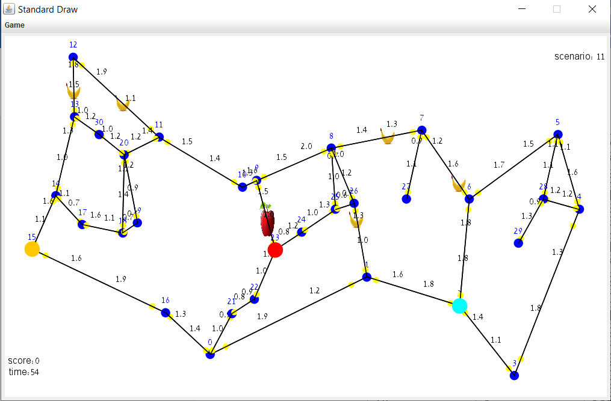
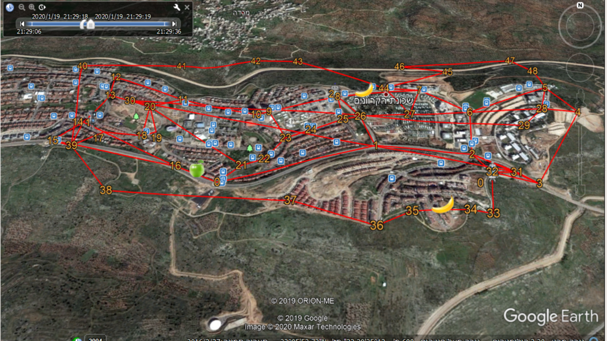

# Welcome to project Ex3 about a client side in a game on directed graph

This repository represents a client side to a game, In this game there is a server that enables to load a scenario between 0 and 23,
in each scenario there is a graph, fruits and robots, each fruit has a value and position on the graph edges and each robot has a position on the graph.
The goal of the game is to get as many points as possible by eating fruits by the robots until the game ends.
There are two types of fruit:
Apple - is located on a edge in the direction from low vertex to high vertex.
Banana - is located on a edge in the direction from high vertex to low vertex.

In order to play the game you must connect to the server using an identity number and then select a stage in the game.
Not all stages are open to the user from the beginning of the game, but there are 11 specific stages that each time you pass with the result and the number of calls to the server required from them, a few stages are opened up to the next filtering stage.
The connection to the server connects the user to a database that allows the game results to be shared with all participants in the game and to track the user's game history and compare results.

This repository allows you to run the game and display it in a graphics window or not display it.
There are two options to running the game: manual and automatic (manual is only possible with a graphical display).
Manual game - In this option the whole game is managed by the user, the user selects the position of the robots on the graph and moves them from one vertex to another by mouse clicks.
Automatic game - In this option the game is managed automatically and efficiently, the robots are initially positioned near the fruits with the highest value and then moving on each time towards the fruit closest to them.

In addition, This repository enables to save the game that ended in a KML file.

Example of a game in a graphic window:

Example of a game display in KML:

